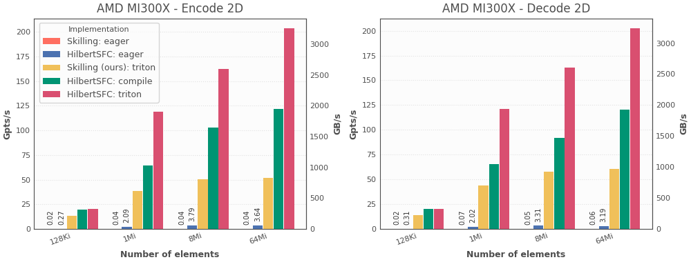
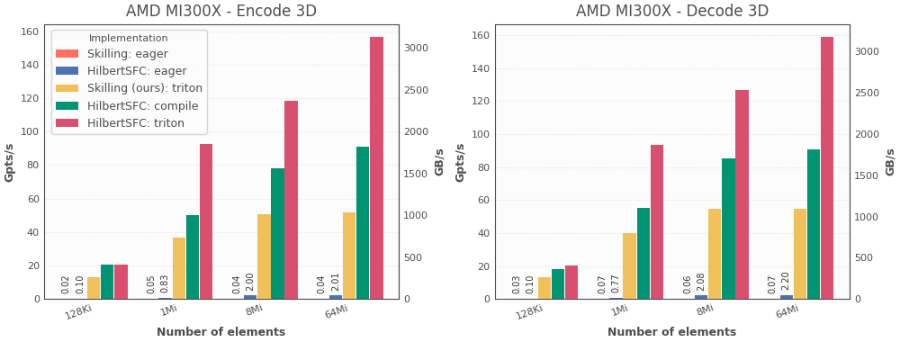
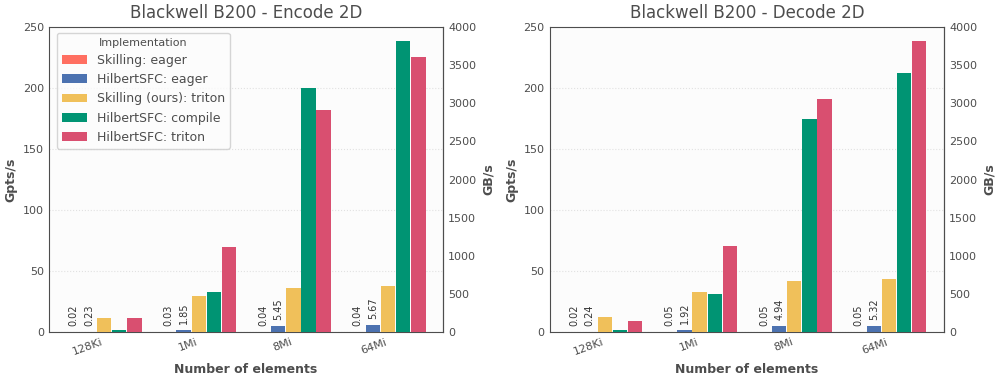
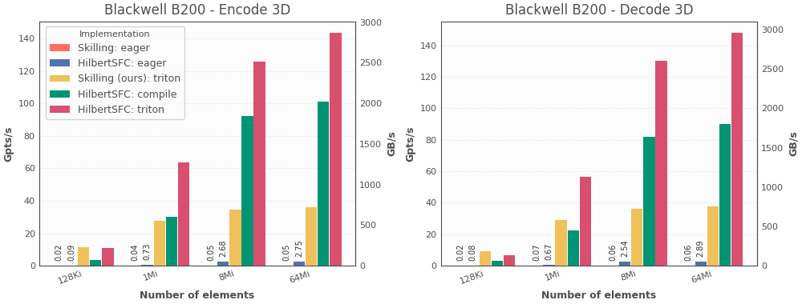
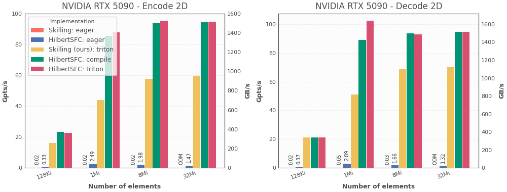
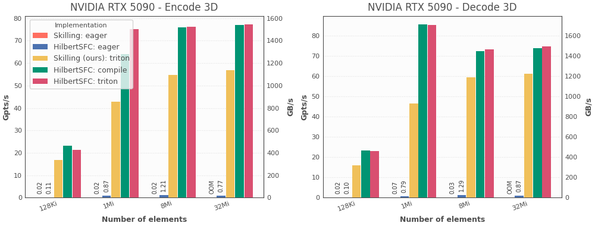

# Benchmark (GPU)

This page reports additional benchmark results for Hilbert encode/decode on three GPUs:

- AMD MI300X
- NVIDIA Blackwell B200
- NVIDIA Blackwell RTX 5090

## Test Methodology

This benchmark follows the same core experiments as the CPU benchmark (encode and decode in both 2D and 3D), but unlike the CPU page it reports results across a sweep of input sizes.

### Benchmark Driver

- Driver: `bench/hilbert_bench_torch/bench_cli.py`

### Benchmark Configuration

Unless otherwise noted, all GPU benchmarks use:

- Fixed RNG seed (identical input across implementations)
- Extra pre-timing warmup calls per implementation: `2` (`--bench-warmup-calls` default)
- 2D settings:
  - Number of bits: `nbits=32` (Max for 2D)
  - Coordinate type: `uint32`
  - Index type: `uint64`
- 3D settings:
  - Number of bits: `nbits=21` (Max for 3D)
  - Coordinate type: `uint32`
  - Index type: `uint64`

### Implementations
The benchmark compare five implementations:
- **Skilling (Pointcept)**: A Skilling algorithm implementation included in the Pointcept library and used by the PTv3 point cloud model, implemented in eager PyTorch. Source: [pointcept/models/utils/serialization/hilbert.py](https://github.com/Pointcept/Pointcept/blob/d74c646db6abec569d0f23e0c34e7ddfce142789/pointcept/models/utils/serialization/hilbert.py)
- **Skilling (Ours)**: A Triton implementation of the Skilling algorithm. It is included to isolate the algorithmic differences between Skilling and HilbertSFC.
- **HilbertSFC (eager)**: The HilbertSFC algorithm implemented in pure PyTorch (ATen ops) and executed eagerly.
- **HilbertSFC (Compile/Inductor)**: A pure PyTorch implementation of HilbertSFC compiled with TorchInductor. For 2D, it uses a separate implementation from the eager version, which when targetted with TorchInductor yields a more efficient kernel. (*FYI*: The 3D eager version already uses a structure that compiles well, hence no specialization here.)
- **HilbertSFC (Triton)**: A Triton implementation of HilbertSFC using shared-memory lookup tables. This benchmark uses Triton >=3.3, which comes with shared memory gather support. On earlier versions, the implementation falls back to global-memory lookup tables. Those results are not included here, but they are generally closer to the Inductor version.

### Runtime Measurement

The benchmark driver uses Triton's built-in benchmarking utility (`triton.testing.do_bench`) for timing.

Inside Triton's benchmark utility, a warmup phase is executed before collecting timing samples, the L2 cache is cleared before each measured iteration, and device timing events are synchronized before summary statistics are returned (including median).

Each `(operation, dimension, size, implementation)` benchmark case runs in an isolated subprocess. This avoids carry-over effects between runs, such as compiled state and allocator/cache state.


## MI300X

Size used for summary table: `64Mi = 67,108,864`

| Implementation | Mode | 2D enc | 2D dec | 3D enc | 3D dec |
| --- | --- | ---: | ---: | ---: | ---: |
| HilbertSFC | triton | 203427 | 202443 | 156540 | 158909 |
| HilbertSFC | inductor | 121371 | 120715 | 90729 | 90645 |
| HilbertSFC | eager | 3640 | 3190 | 2010 | 2200 |
| Skilling (Ours) | triton | 51734 | 60910 | 51634 | 54523 |
| Skilling (Pointcept) | eager | 37.4 | 60.0 | 39.4 | 65.2 |





## Blackwell B200

Size used for summary table: `64Mi = 67,108,864`

| Implementation | Mode | 2D enc | 2D dec | 3D enc | 3D dec |
| --- | --- | ---: | ---: | ---: | ---: |
| HilbertSFC | triton | 225234 | 238367 | 143405 | 147926 |
| HilbertSFC | inductor | 238340 | 212091 | 101287 | 89898 |
| HilbertSFC | eager | 5668 | 5324 | 2745 | 2886 |
| Skilling (Ours) | triton | 37581 | 43230 | 36008 | 37622 |
| Skilling (Pointcept) | eager | 37.9 | 48.4 | 46.4 | 63.1 |





## Blackwell RTX 5090

Size used for summary table: `32Mi = 33,554,432`

| Implementation | Mode | 2D enc | 2D dec | 3D enc | 3D dec |
| --- | --- | ---: | ---: | ---: | ---: |
| HilbertSFC | triton | 94573 | 94804 | 77283 | 74818 |
| HilbertSFC | inductor | 94288 | 94834 | 76920 | 73797 |
| HilbertSFC | eager | 1468 | 1321 | 774 | 874 |
| Skilling (Ours) | triton | 59578 | 70017 | 56889 | 61138 |
| Skilling (Pointcept) | eager | OOM | OOM | OOM | OOM |





## Reproducing benchmark runs

All benchmark runs on this page are generated with `bench/hilbert_bench_torch/bench_cli.py`:

```bash
uv run --group torch-cu130 bench/hilbert_bench_torch/bench_cli.py \
  --op both --dims 2 3 \
  --nbits-2d 32 --nbits-3d 21 \
  --2d-coord-dtype uint32 --3d-coord-dtype uint32 \
  --2d-index-dtype uint64 --3d-index-dtype uint64 \
  --device cuda \
  --min-exp 12 --max-exp 26
```

For AMD (ROCm), replace `--group torch-cu130` with `--group torch-rocm`.
